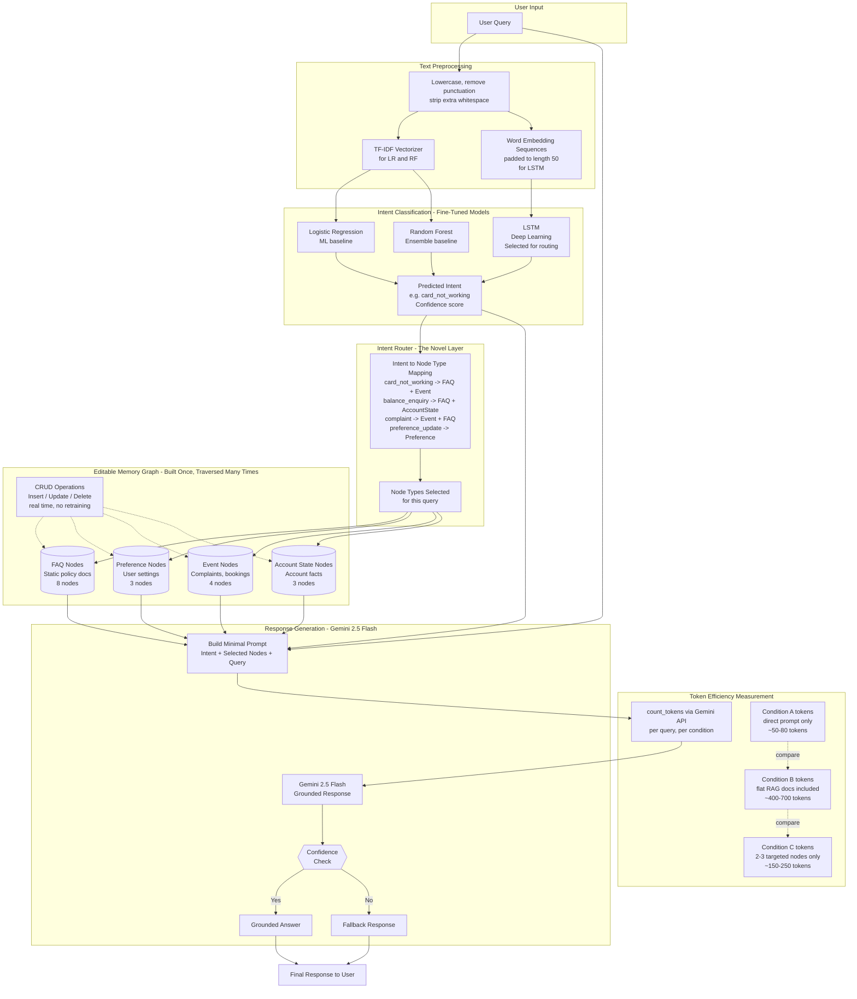
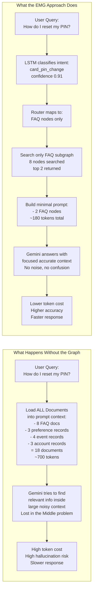
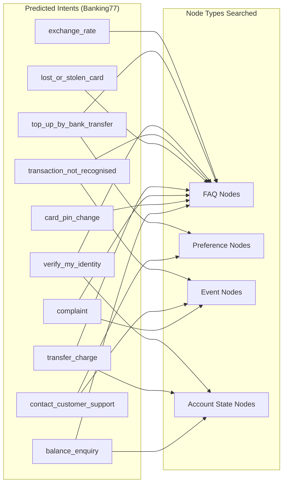
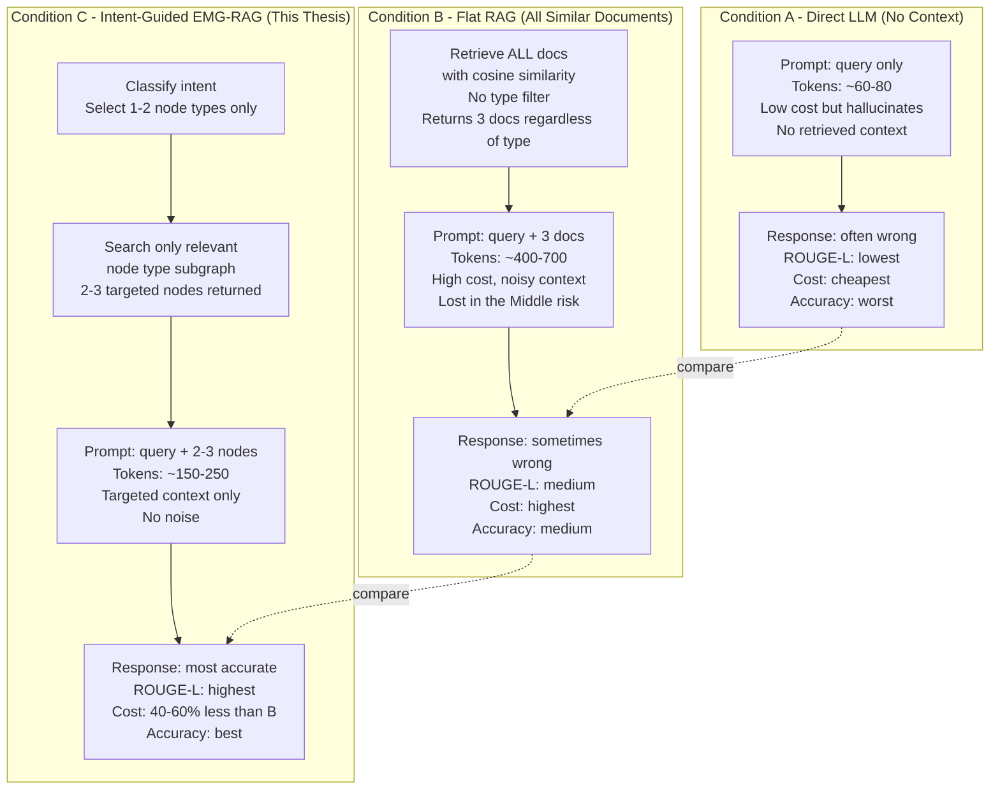
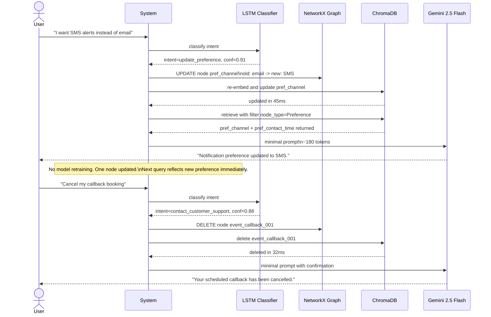
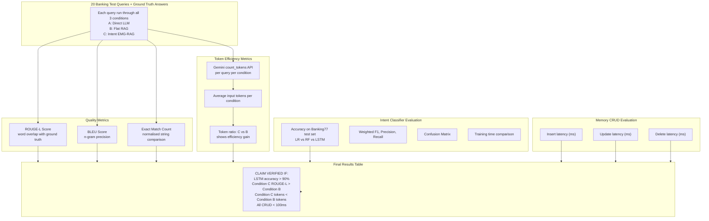
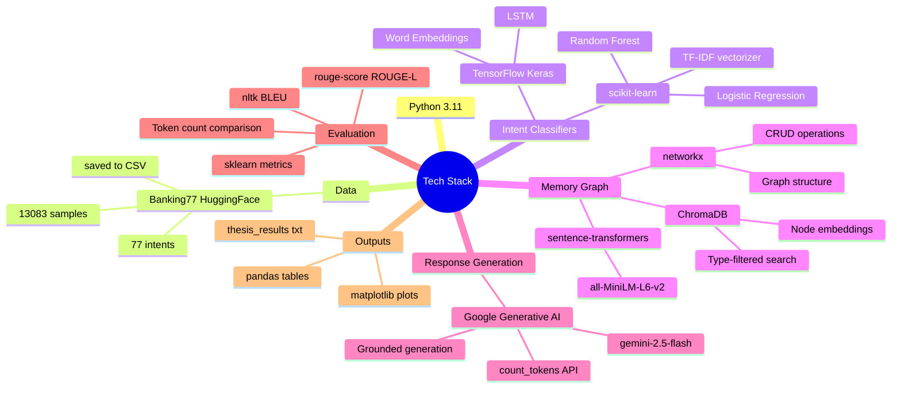

# System Architecture
# Knowledge Graph-Based Editable Memory for Token-Efficient Personalised Banking AI

**Student:** Jai Prabhas Malluri (24310875)

---

## Architecture Philosophy

The architecture is designed around three problems. Token exhaustion is solved by graph traversal (only 2-3 nodes retrieved per query). Dynamic memory is solved by editable graph nodes (CRUD without retraining). Intent-context mismatch is solved by the routing layer (intent classifier controls which node types are searched). Each layer solves one problem.

---

## Diagram 1 - Full System Architecture with Token Cost Awareness

---

## Diagram 2 - The Graphify Analogy Applied to Banking AI

---

## Diagram 3 - Editable Memory Graph Node Structure

```mermaid
graph TD
    ROOT["Banking AI Memory Graph\n18 nodes, 4 types"]

    ROOT --> FAQ_G["FAQ Subgraph\n8 nodes - static policy"]
    ROOT --> USER_G["User Memory Subgraph\n10 nodes - dynamic, editable"]

    FAQ_G --> F1["faq_balance_check\nHow to check balance..."]
    FAQ_G --> F2["faq_transfer_limit\nDaily limit 10000 euros..."]
    FAQ_G --> F3["faq_card_pin_reset\nReset PIN via ATM or app..."]
    FAQ_G --> F4["faq_card_cancel\nFreeze card in app..."]
    FAQ_G --> F5["faq_direct_debit\nManage in Payments section..."]
    FAQ_G --> F6["faq_exchange_rate\nUpdated daily, check in app..."]
    FAQ_G --> F7["faq_top_up\nTop up via app or branch..."]
    FAQ_G --> F8["faq_statement\nMonthly PDF in app history..."]

    USER_G --> PREF_G["Preference Nodes\n3 nodes - editable"]
    USER_G --> EVENT_G["Event Nodes\n4 nodes - editable"]
    USER_G --> ACCT_G["Account State Nodes\n3 nodes - editable"]

    PREF_G --> P1["pref_channel\nValue: SMS\nLast updated: 2026-05-29"]
    PREF_G --> P2["pref_language\nValue: English formal\nLast updated: 2026-01-01"]
    PREF_G --> P3["pref_contact_time\nValue: 9am-12pm morning\nLast updated: 2026-03-15"]

    EVENT_G --> E1["event_complaint_001\nBilling dispute 2026-04-15\nStatus: under review"]
    EVENT_G --> E2["event_callback_001\nCallback 2026-05-30 10am\nAgent: Sarah"]
    EVENT_G --> E3["event_application_001\nJoint account applied\nRef: JA2026001"]
    EVENT_G --> E4["event_dispute_002\nUnauthorised 250 euro\nRef: D2026002 open"]

    ACCT_G --> A1["acct_type\nCurrent Account Gold tier\nOpened 2022"]
    ACCT_G --> A2["acct_limits\nTransfer: 10000/day\nCard: 3000/day"]
    ACCT_G --> A3["acct_kyc\nKYC valid 2027-12-31\nPassport verified"]
```

---

## Diagram 4 - Intent to Node Type Routing Table

---

## Diagram 5 - Token Efficiency: How the Graph Reduces Token Cost

---

## Diagram 6 - CRUD Operations: Real-Time Memory Update Without Retraining

---

## Diagram 7 - Evaluation Pipeline (4 Dimensions)

---

## Diagram 8 - Technology Stack

---

## What Is Novel in This Architecture

| Component | What Existing Work Does | What This Thesis Adds |
|-----------|------------------------|----------------------|
| RAG retrieval | Flat cosine similarity, all types | Intent-filtered, only relevant node types |
| Memory graph | EMG with flat similarity retrieval (Wang 2024) | EMG with intent-guided typed traversal |
| Token cost | Not measured in EMG-RAG papers | Measured with Gemini count_tokens API |
| Knowledge graph | Built once, static content (GraphRAG, Graphify) | Built once, editable via CRUD, dynamic user data |
| Evaluation | Quality metrics only | Quality + token efficiency + CRUD latency |
| Domain | General assistant (Wang 2024) | Banking domain, Banking77 benchmark |

The table shows that no single existing paper combines all of these elements. The combination is the contribution.

---

*Jai Prabhas Malluri - 24310875 - System Architecture v3*
