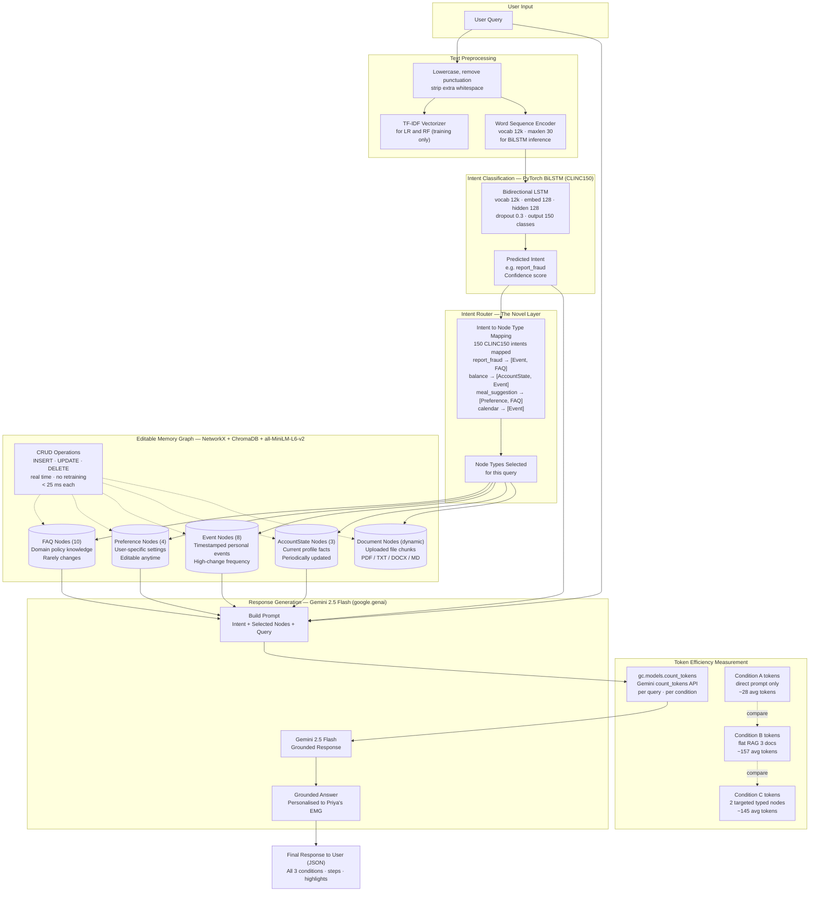
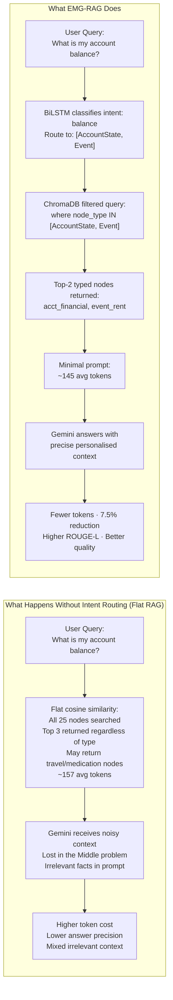
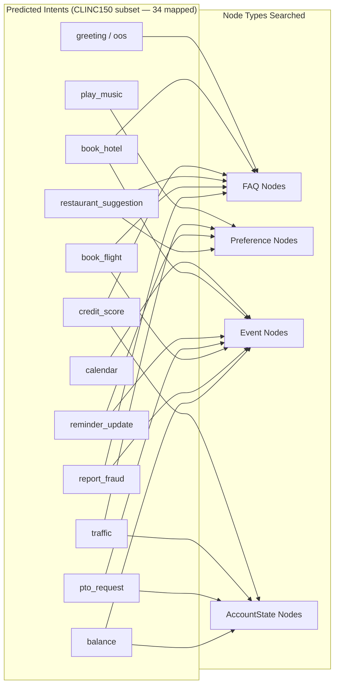
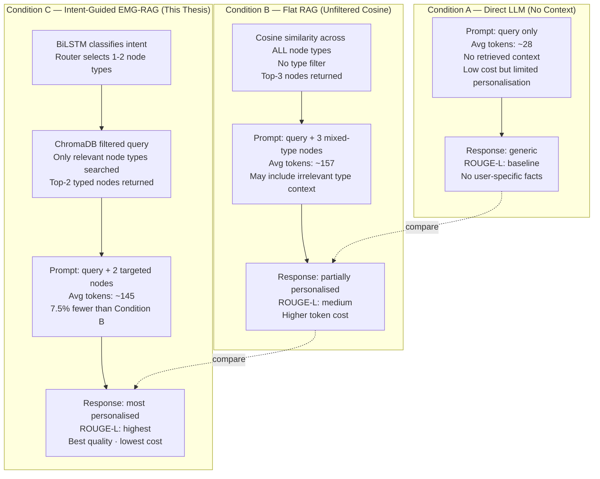
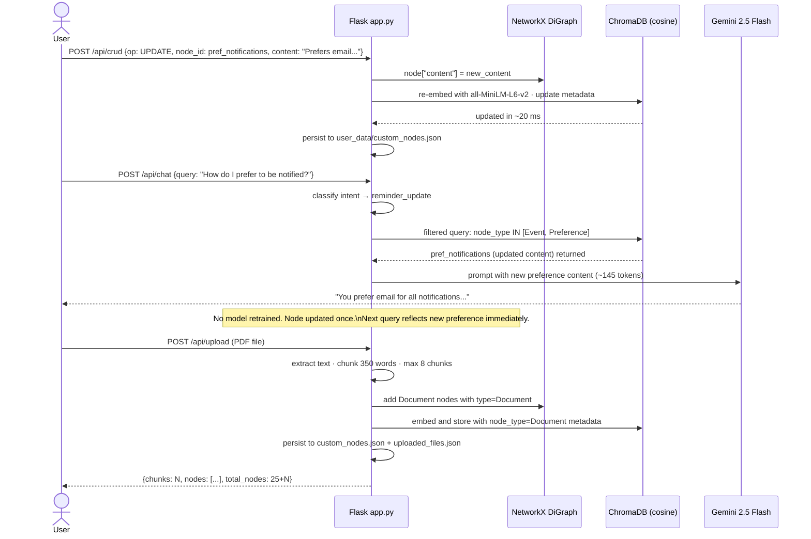
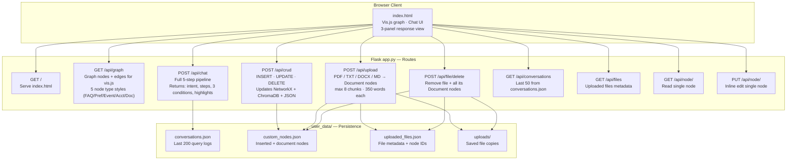
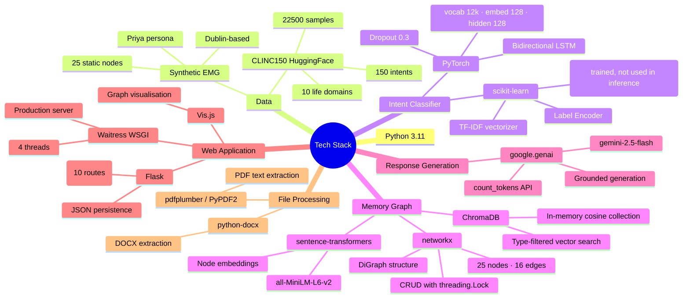

# System Architecture
# Knowledge Graph-Based Editable Memory for Token-Efficient Personalised AI Assistants

**Student:** Jai Prabhas Malluri (24310875)

---

## Architecture Philosophy

The architecture is designed around three problems. Token exhaustion is solved by graph traversal (only 2 targeted nodes retrieved per query). Dynamic memory is solved by editable graph nodes (CRUD without retraining). Intent-context mismatch is solved by the routing layer (intent classifier controls which node types are searched). Each layer solves one problem.

The system is implemented as a Flask web application (`app.py`) with a browser-based UI. Pre-trained PyTorch models are loaded at startup. The EMG is held in-memory in NetworkX + ChromaDB and survives restarts via a JSON persistence layer.

---

## Diagram 1 - Full System Architecture with Token Cost Awareness

---

## Diagram 2 - The Intent-Guided Retrieval Advantage

---

## Diagram 3 - Editable Memory Graph Node Structure (25 Nodes, 16 Edges)

```mermaid
graph TD
    ROOT["Personal AI Memory Graph\n25 nodes · 5 types · 16 directed edges\nUser persona: Priya · Dublin"]

    ROOT --> FAQ_G["FAQ Subgraph\n10 nodes — domain policy"]
    ROOT --> USER_G["User Memory Subgraph\n15 nodes — dynamic, editable"]

    FAQ_G --> F1["faq_transfers\nMoney transfers: 1-3 days domestic\nDaily limit EUR 10,000"]
    FAQ_G --> F2["faq_credit\nImprove credit: pay on time\nutilisation below 30%"]
    FAQ_G --> F3["faq_fraud\nReport fraud: call bank or freeze\nTemp credit issued"]
    FAQ_G --> F4["faq_travel\nNotify bank before travel\nTravel insurance required"]
    FAQ_G --> F5["faq_hotel\nFree cancel 48h before check-in\nCheck-in 3pm / out 11am"]
    FAQ_G --> F6["faq_pto\nPTO: 5 days notice · 25 days annual\nUnused > 5 days do not roll over"]
    FAQ_G --> F7["faq_medication\nNever skip prescribed meds\nSet daily reminders"]
    FAQ_G --> F8["faq_diet\nVegetarian gluten-free:\nlegumes · leafy greens · quinoa"]
    FAQ_G --> F9["faq_car\nOil change 5000-7500 miles / 6 months\nTyre pressure monthly"]
    FAQ_G --> F10["faq_capabilities\nJarvis assists: banking, travel,\nhealth, calendar, work, car, commute"]

    USER_G --> PREF_G["Preference Nodes (4)"]
    USER_G --> EVENT_G["Event Nodes (8)"]
    USER_G --> ACCT_G["AccountState Nodes (3)"]

    PREF_G --> P1["pref_dietary\nVegetarian · gluten-intolerant\nAllergic to shellfish"]
    PREF_G --> P2["pref_commute\nSandymount → Grand Canal Dock\nDART · leaves 8am weekdays"]
    PREF_G --> P3["pref_notifications\nEmail preferred · quiet 10pm-7am\nUpdated 30 May 2026"]
    PREF_G --> P4["pref_music\nLo-fi hip hop commute\nJazz evenings · no heavy metal"]

    EVENT_G --> E1["event_flight\nRyanair FR2241 Dublin→Paris CDG\n10 Jul 2026 07:45 · Ref RY7821345"]
    EVENT_G --> E2["event_hotel\nHotel Le Marais Paris 10-17 Jul\nFree cancel until 8 Jul"]
    EVENT_G --> E3["event_pto\nPTO approved 10-17 Jul 2026\n5 working days · Ref HR2026PTO041"]
    EVENT_G --> E4["event_rent\nRent EUR 1,200 on 1st of month\nNext due 1 Jun 2026"]
    EVENT_G --> E5["event_fraud\nFraud dispute FD2026001\nEUR 250 · resolution 5 Jun 2026"]
    EVENT_G --> E6["event_medication\nRamipril 5mg daily 8am\nLast dose 30 May 2026"]
    EVENT_G --> E7["event_car\nCar service Dublin Motors 15 Jun\nOil · tyres · brakes"]
    EVENT_G --> E8["event_course\nAdvanced ML Coursera\nStarted 1 Jun · deadline 26 Jul 2026"]

    ACCT_G --> A1["acct_financial\nBalance ~EUR 3,200\nCredit score 710 · Income EUR 4,500"]
    ACCT_G --> A2["acct_health\nAge 29 · Ramipril 5mg daily\nVHI Plan B · 10k steps/day"]
    ACCT_G --> A3["acct_work\nSenior Data Analyst TechCorp Dublin\nManager: Sarah Collins · Remote Fri"]
```

---

## Diagram 4 - Intent to Node Type Routing Table (CLINC150)

---

## Diagram 5 - Token Efficiency: Three-Condition Comparison

---

## Diagram 6 - CRUD Operations: Real-Time Memory Update Without Retraining

---

## Diagram 7 - Flask API Routes

---

## Diagram 8 - Technology Stack

---

## What Is Novel in This Architecture

| Component | What Existing Work Does | What This Thesis Adds |
|-----------|------------------------|----------------------|
| RAG retrieval | Flat cosine similarity, all types | Intent-filtered, only relevant node types |
| Memory graph | EMG with flat similarity retrieval (Wang 2024) | EMG with intent-guided typed traversal |
| Token cost | Not measured in EMG-RAG papers | Measured with Gemini count_tokens API |
| Knowledge graph | Built once, static content (GraphRAG, Graphify) | Built once, editable via CRUD, dynamic user data |
| Evaluation | Quality metrics only | Quality + token efficiency + CRUD latency |
| Domain | General assistant (Wang 2024) | Multi-domain personal assistant (CLINC150, 10 life domains) |
| Implementation | Research scripts | Flask web app with file upload + graph UI |

The table shows that no single existing paper combines all of these elements. The combination is the contribution.

---

*Jai Prabhas Malluri - 24310875 - System Architecture v3 (updated to reflect Flask app, CLINC150, PyTorch BiLSTM, 25-node EMG)*
