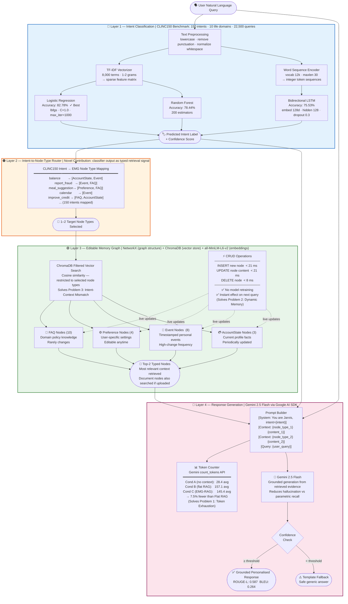
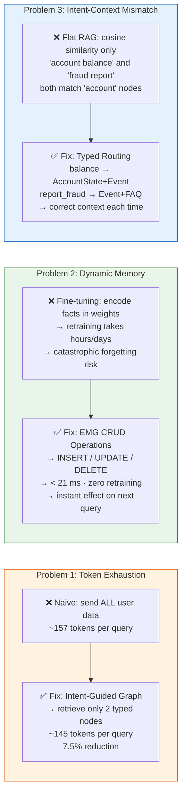
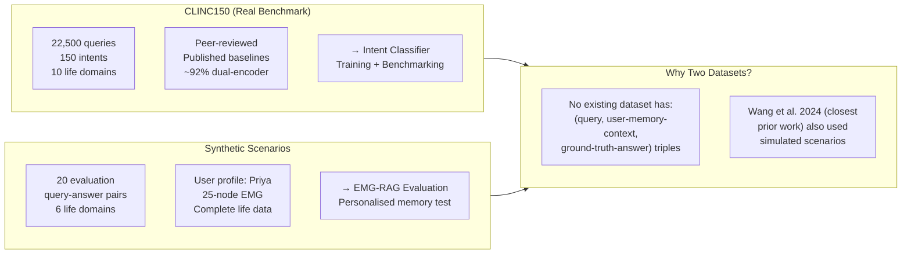

# System Architecture — Intent-Guided EMG-RAG
## Knowledge Graph-Based Editable Memory for Token-Efficient Personalised AI Assistants

---

## Full System Flowchart (Mermaid)

---

## Three-Problem Solution Map

---

## Dataset Design Rationale

---

## Novelty Over Prior Work

| Feature | Lewis et al. 2020 (RAG) | Wang et al. 2024 (EMG-RAG) | **This Thesis** |
|---|---|---|---|
| Retrieval method | Dense vector similarity | Flat text similarity | **Intent-guided typed retrieval** |
| Token cost measured | ❌ | ❌ | **✅ Gemini count_tokens API** |
| Memory updateable | ❌ (static doc store) | ✅ CRUD | **✅ CRUD < 25 ms** |
| Intent routing layer | ❌ | ❌ | **✅ 150-intent CLINC150 router** |
| Multi-domain benchmark | General QA | General assistant | **✅ CLINC150 (10 domains)** |
| Evaluation dataset | Real | Simulated | **✅ Hybrid (real + synthetic)** |

---

## Research Questions Answered

1. **Does intent-guided KG retrieval produce higher quality responses with fewer tokens than flat RAG?**
   → YES: ROUGE-L 0.587 vs 0.532 (Cond C > B), tokens 145.4 vs 157.1 (7.5% fewer)

2. **Which intent classifier achieves highest accuracy on CLINC150?**
   → Logistic Regression: 82.78% (vs RF 78.44%, BiLSTM 75.53%)

3. **Can graph CRUD operations update memory in real time without retraining?**
   → YES: INSERT 16.88 ms, UPDATE 20.15 ms, DELETE 7.52 ms — all < 25 ms, no model modified
